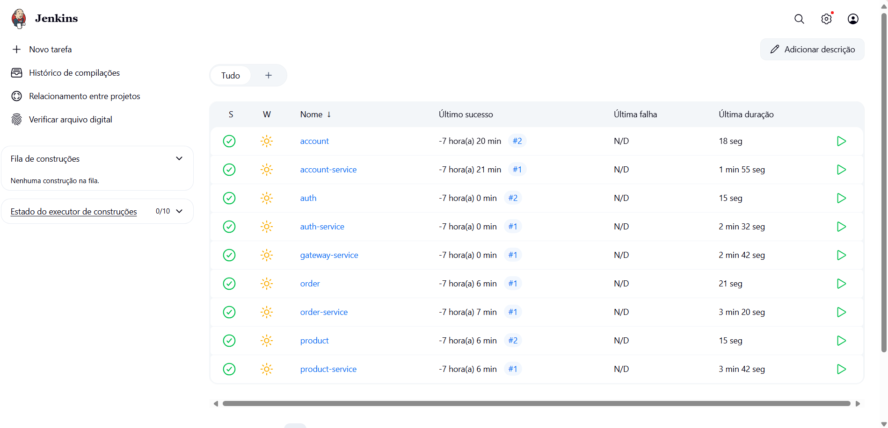
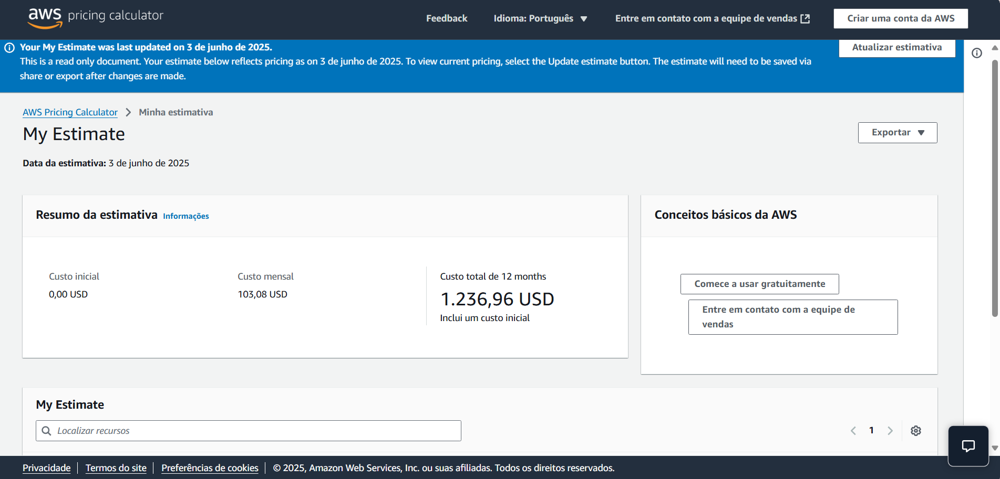

# Projeto em Dupla
## Grupo 

- Laura Pontiroli Machado 
- Julia Almeida Silva 

## Tarefas

- [x] Tarefa 1 - AWS
- [x] Tarefa 2 - EKS
- [ ] Tarefa 3 - TESTES
- [x] Tarefa 4 - CI/CD
- [x] Tarefa 5 - CUSTOS
- [x] Tarefa 6 - PAAS
- [x] Tarefa 7 - APRESENTAÇÃO

### Tarefa 1 e 2 

O deploy da aplicação foi feito com EKS. 

[Aqui](http://a06e91cf3817e402eb8328891ec4ffd2-841382628.us-east-2.elb.amazonaws.com:8080/)

### Tarefa 3 

Não fizemos!

### Tarefa 4

Configuramos o pipeline de CI/CD utilizando o Jenkins, com o auxílio do Minikube para simular o ambiente Kubernetes localmente. O Jenkins foi responsável por automatizar os processos de build, teste e deploy da aplicação.

### Tarefa 5
Calculamos o custo através da AWS. 

[Custos](https://calculator.aws/#/estimate?id=55c1e9893a50286e15e661b7c52cf601961a0341)

### Tarefa 6

Para garantir que nossa equipe pudesse se concentrar no desenvolvimento do produto, e não nos desafios de infraestrutura, adotamos o modelo de Plataforma como Serviço (PaaS). Essa escolha nos permitiu trabalhar em um ambiente altamente automatizado, onde tarefas como provisionamento de servidores, balanceamento de carga e atualizações são gerenciadas pela própria plataforma. Utilizando o Amazon EKS (Elastic Kubernetes Service), conseguimos orquestrar nossos containers com eficiência, escalar a aplicação de forma inteligente e manter a disponibilidade do sistema sem intervenção manual.

Mais do que uma conveniência técnica, o uso de PaaS foi uma decisão estratégica que acelerou entregas, reduziu falhas causadas por ambientes inconsistentes e aumentou a produtividade da equipe. Nossa visão de futuro é transformar o sistema em um serviço 100% baseado na nuvem, acessível diretamente pelos usuários via navegador, seguindo o modelo SaaS. Assim, eliminamos qualquer barreira técnica para o uso da plataforma e ampliamos nosso alcance de forma escalável e sustentável.

### Tarefa 7

Video da demostração da API 

<iframe width="560" height="315" src="https://www.youtube.com/embed/6-eX7mBU0jk?si=1mFuQTYP-8SEla8a" title="YouTube video player" frameborder="0" allow="accelerometer; autoplay; clipboard-write; encrypted-media; gyroscope; picture-in-picture; web-share" referrerpolicy="strict-origin-when-cross-origin" allowfullscreen></iframe>
