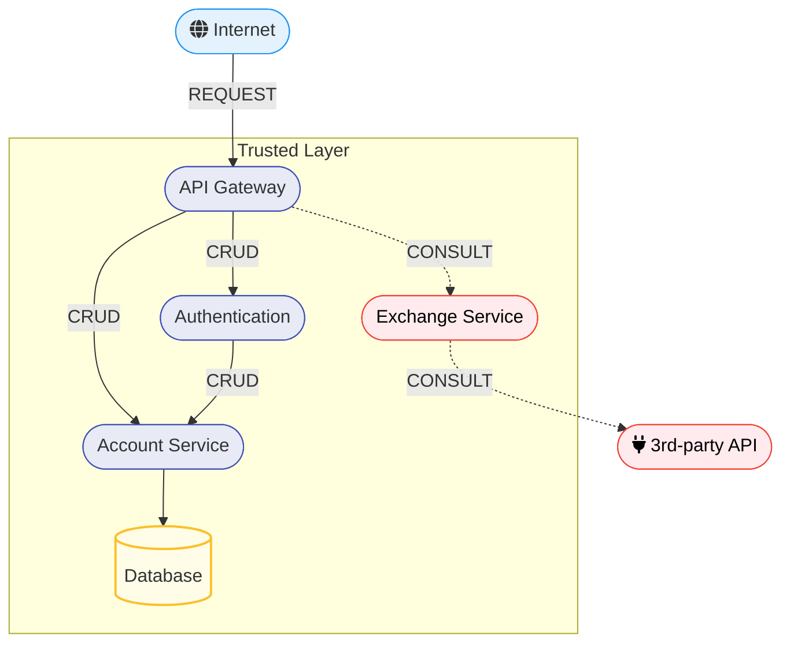

## Objetivo

O objetivo para esse roteiro era desenvolver o microsserviço EXCHANGE. Nele o usuário poderia pegar o valor de sell e de buy da conversão de uma moeda para outra.

## Montagem do Roteiro


### Tarefa 1

Escolher api pra conexão.

A primeira coisa a se fazer foi escolher a api para fazer a conversão e ver a documentação da api para descobrir se ela enviava os valores necessários (sell e buy)

A Api escolhida foi a [AwesomeAPI](https://docs.awesomeapi.com.br/api-de-moedas).

### Tarefa 2

Fazer a conexão com a api e a rota do exchange em FASTAPI 

=== "Main.py do Exchange"

    ``` { .py .copy .select linenums='1' title="main.py" }
    --8<-- "https://raw.githubusercontent.com/laupontiroli/exchange-service/main/app/main.py"
    ```


### Tarefa 3

Fazer o dockerfile para encaixar o programa dentro do serviço desse jeito:



=== "Dockerfile do Exchange"

    ``` {  .copy .select linenums='1' title="Dockerfile" }
    --8<-- "https://raw.githubusercontent.com/laupontiroli/exchange-service/main/Dockerfile"
    ```


Também foi adicionado no compose.yaml geral esse serviço 

=== "Compose.yaml"

    ``` {  .yaml .copy .select linenums='1' title="Compose.yaml" }
    --8<-- "https://raw.githubusercontent.com/laupontiroli/platforms/main/apis/compose.yaml"
    ```


## Discussões

Esse roteiro foi particulamente fácil. O mais dificil foi entender como montar o dockerfile e adicionar ao compose geral.

## Conclusão

Com essa parte do roteiro nos aprendemos a adicionar microsserviços e também que é possível a integração entre serviços de diferentes linguagens.