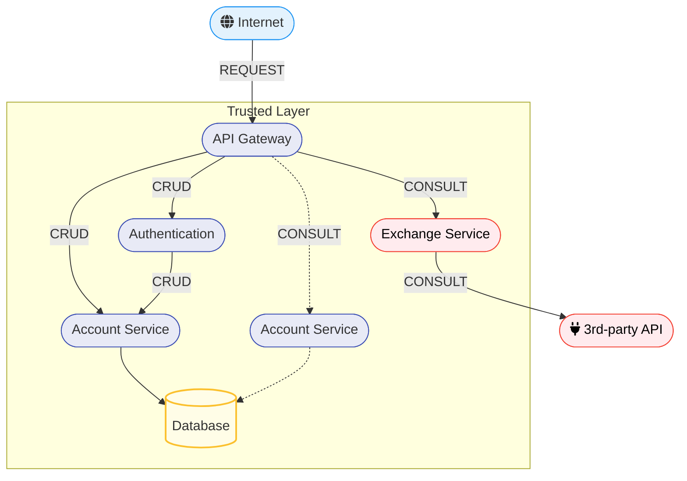

## Objetivo

O objetivo para esse roteiro era desenvolver o microsserviço PRODUCT. Nele o usuário poderia criar, consultar e deletar produtos no sistema.
## Montagem do Roteiro


### Tarefa 1

Criar uma API restfull para os produtos.

A API deveria conter as seguintes rotas: 

!!! info "POST /product"

    Criar um produto novo
    === "Request"

        ``` { .json .copy .select linenums='1' }
        {
            "name": "Tomato",
            "price": 10.12,
            "unit": "kg"
        }
        ```

    === "Response"

        ``` { .json .copy .select linenums='1' }
        {
            "id": "0195abfb-7074-73a9-9d26-b4b9fbaab0a8",
            "name": "Tomato",
            "price": 10.12,
            "unit": "kg"
        }
        ```
        ```bash
        Response code: 201 (created)
        ```

!!! info "GET /product"

    Consultar todos os produtos

    === "Response"

        ``` { .json .copy .select linenums='1' }
        [
            {
                "id": "0195abfb-7074-73a9-9d26-b4b9fbaab0a8",
                "name": "Tomato",
                "price": 10.12,
                "unit": "kg"
            },
            {
                "id": "0195abfe-e416-7052-be3b-27cdaf12a984",
                "name": "Cheese",
                "price": 0.62,
                "unit": "slice"
            }
        ]
        ```
        ```bash
        Response code: 200 (ok)
        ```

!!! info "GET /product/{id}"

    Consultar produto por ID.

    === "Response"

        ``` { .json .copy .select linenums='1' }
        {
            "id": "0195abfb-7074-73a9-9d26-b4b9fbaab0a8",
            "name": "Tomato",
            "price": 10.12,
            "unit": "kg"
        }
        ```
        ```bash
        Response code: 200 (ok)
        ```

!!! info "DELETE /product/{id}"

    Deletar produto por ID.

    ```bash
    Response code: 204 (no content)
    ```


## Tarefa 2 

Separar product em product e product service para uma melhor estrutura. 

Para isso, depois de desenvolvido todo o código de product, product-service precisaria ter a dependencia no projeto product. 

=== "pom.xml do product-service"

    ``` {  .xml .copy .select linenums='1' title="pom.xml" }
    --8<-- "https://raw.githubusercontent.com/laupontiroli/product-service/main/pom.xml"
    ```

=== "Resource - (implementação do controller)"

    ``` {  .java .copy .select linenums='1' title="ProductResource.java" }
    --8<-- "https://raw.githubusercontent.com/laupontiroli/product-service/main/src/main/java/store/product/ProductResource.java"
    ```
### Tarefa 3

Adicionar A API dentro do serviço Para que se encaixasse no seguinte esquema




=== "Compose.yaml"

    ``` {  .yaml .copy .select linenums='1' title="Compose.yaml" }
    --8<-- "https://raw.githubusercontent.com/laupontiroli/platforms/main/apis/compose.yaml"
    ```

=== "Resource - (implementação do controller)"

    ``` {  .java .copy .select linenums='1' title="ProductResource.java" }
    --8<-- "https://raw.githubusercontent.com/laupontiroli/product-service/main/src/main/java/store/product/ProductResource.java"
    ```


## Discussões

Esse roteiro foi um pouco mais complicado que o anterior, necessitando entender a estrutura do account e account-service para poder replicar ela para o product. 

## Conclusão

Com essa parte do roteiro nos aprendemos a replicar a estrutura de um serviço para um outro serviço. 