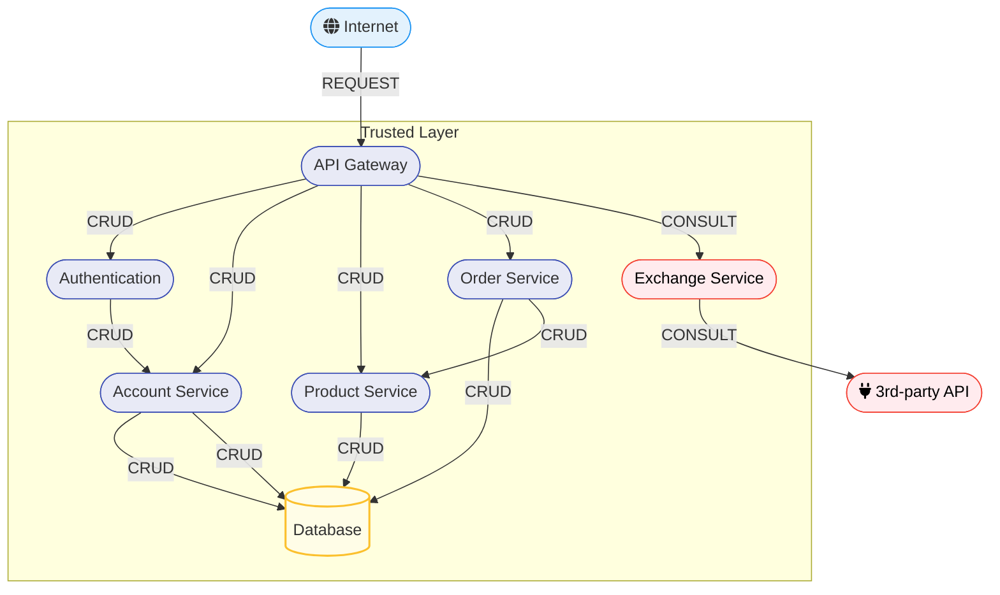

## Objetivo

O objetivo para esse roteiro era desenvolver o microsserviço ORDER. Nele o usuário poderia criar, consultar e deletar orders no sistema feitos pelo mesmo usuário.
## Montagem do Roteiro


### Tarefa 1

Criar uma API restfull para orders.

A API deveria conter as seguintes rotas: 

!!! info "POST /order"

    Criar um novo order a partir do **usuario atual**

    === "Request"

        ``` { .json .copy .select linenums='1' }
        {
            "items": [
                {
                    "idProduct": "0195abfb-7074-73a9-9d26-b4b9fbaab0a8",
                    "quantity": 2
                },
                {
                    "idProduct": "0195abfe-e416-7052-be3b-27cdaf12a984",
                    "quantity": 1
                }
            ]
        }
        ```

    === "Response"

        ``` { .json .copy .select linenums='1' }
        {
            "id": "0195ac33-73e5-7cb3-90ca-7b5e7e549569",
            "date": "2025-09-01T12:30:00",
            "items": [
                {
                    "id": "01961b9a-bca2-78c4-9be1-7092b261f217",
                    "product": {
                        "id": "0195abfb-7074-73a9-9d26-b4b9fbaab0a8"
                    },
                    "quantity": 2,
                    "total": 20.24
                },
                {
                    "id": "01961b9b-08fd-76a5-8508-cdb6cd5c27ab",
                    "product": {
                        "id": "0195abfe-e416-7052-be3b-27cdaf12a984"
                    },
                    "quantity": 10,
                    "total": 6.2
                }
            ],
            "total": 26.44
        }
        ```
        ```bash
        Response code: 201 (created)
        Response code: 400 (bad request), if the product does not exist.
        ```

!!! info "GET /order"

    Consultar todos os order do **usuario atual**

    === "Response"

        ``` { .json .copy .select linenums='1' }
        [
            {
                "id": "0195ac33-73e5-7cb3-90ca-7b5e7e549569",
                "date": "2025-09-01T12:30:00",
                "total": 26.44
            },
            {
                "id": "0195ac33-cbbd-7a6e-a15b-b85402cf143f",
                "date": "2025-10-09T03:21:57",
                "total": 18.6
            }
            
        ]
        ```
        ```bash
        Response code: 200 (ok)
        ```

!!! info "GET /order/{id}"

    Obtenha os detalhes de um order pelo seu ID. **O order deve pertencer ao usuário atual**, caso contrário, retorne um `404`.

    === "Response"

        ``` { .json .copy .select linenums='1' }
        {
            "id": "0195ac33-73e5-7cb3-90ca-7b5e7e549569",
            "date": "2025-09-01T12:30:00",
            "items": [
                {
                    "id": "01961b9a-bca2-78c4-9be1-7092b261f217",
                    "product": {
                        "id": "0195abfb-7074-73a9-9d26-b4b9fbaab0a8",
                    },
                    "quantity": 2,
                    "total": 20.24
                },
                {
                    "id": "01961b9b-08fd-76a5-8508-cdb6cd5c27ab",
                    "product": {
                        "id": "0195abfe-e416-7052-be3b-27cdaf12a984",
                    },
                    "quantity": 10,
                    "total": 6.2
                }
            ],
            "total": 26.44
        }
        ```
        ```bash
        Response code: 200 (ok)
        Response code: 404 (not found), if the order does not belong to the current user.
        ```

## Tarefa 2 

Separar order em order e order-service para uma melhor estrutura. 

Para isso, depois de desenvolvido todo o código de order, order-service precisaria ter a dependencia no projeto order-service. 

=== "pom.xml do order-service"

    ``` {  .xml .copy .select linenums='1' title="pom.xml" }
    --8<-- "https://raw.githubusercontent.com/laupontiroli/order-service/main/pom.xml"
    ```

### Tarefa 3

Adicionar A API dentro do serviço Para que se encaixasse no seguinte esquema




=== "Compose.yaml"

    ``` {  .yaml .copy .select linenums='1' title="Compose.yaml" }
    --8<-- "https://raw.githubusercontent.com/laupontiroli/platforms/main/apis/compose.yaml"
    ```

=== "Resource - (implementação do controller)"

    ``` {  .java .copy .select linenums='1' title="OrderResource.java" }
    --8<-- "https://raw.githubusercontent.com/laupontiroli/order-service/main/src/main/java/store/order/OrderResource.java"
    ```


## Discussões

Esse roteiro foi o mais complicado de todos. Além de desenvolver o order e order-service, foi necessário integrar com o product também para poder puxar os dados dos produtos adicionados e fazer as contas do total etc.

## Conclusão

Com essa parte do roteiro podemos interagir mais como integração de microsserviços e comunicação entre os serviços, entender como essa comunicação funciona e como interagir com outro serviço.