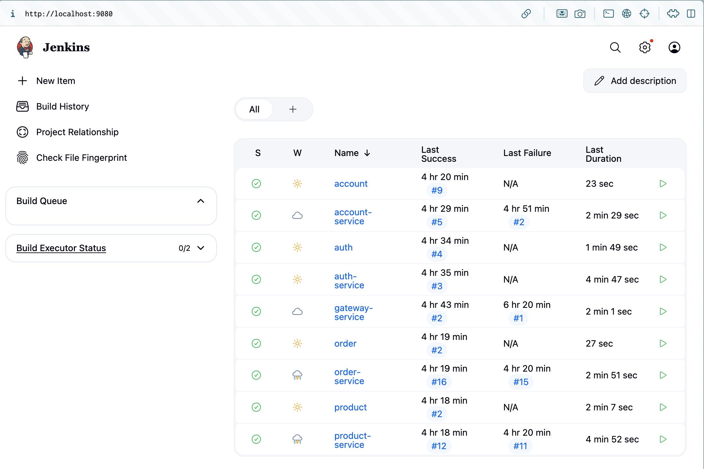

## Objetivo

O objetivo para esse roteiro era adicionar o nosso serviço no Jenkins. O jenkins é uma ferramenta para CI/CD (continious integration, continious deployment). Ela faz com que o deploy seja automático apartir da atualização da implementação.

## Montagem do Roteiro

### Tarefa 1

Criar uma conta no Jenkins. 

Para isso foi necessário rodar o seguinte compose: 

=== "Compose Jenkins"

    ``` {   .copy .select linenums='1' title="Jenkinsfile" }
    --8<-- "https://raw.githubusercontent.com/laupontiroli/platforms/main/jenkins/compose.yaml"
    ```

Assim criamos a imagem do jenkins no nosso docker para poder subir os serviços 

### Tarefa 2 

Adicionar os arquivos do jenkins em todos os serviços. Seguindo o seguinte padrão:

=== "Jenkinsfile do gateway"

    ``` {   .copy .select linenums='1' title="Jenkinsfile" }
    --8<-- "https://raw.githubusercontent.com/laupontiroli/gateway-service/main/Jenkinsfile"
    ```

### Tarefa 3 

Subir todos os serviços e repositórios como itens no Jenkins e ver se está tudo certo 



## Discussões

Esse roteiro Não foi tão complicado como os outros, uma vez que você entende todos os arquivos q precisam existir e aonde adicionar as coisas certas.

## Conclusão

Jenkins é uma ótima ferramenta pra organizar projetos, especialmente quando temoss diferentes serviços que interagem com outros.