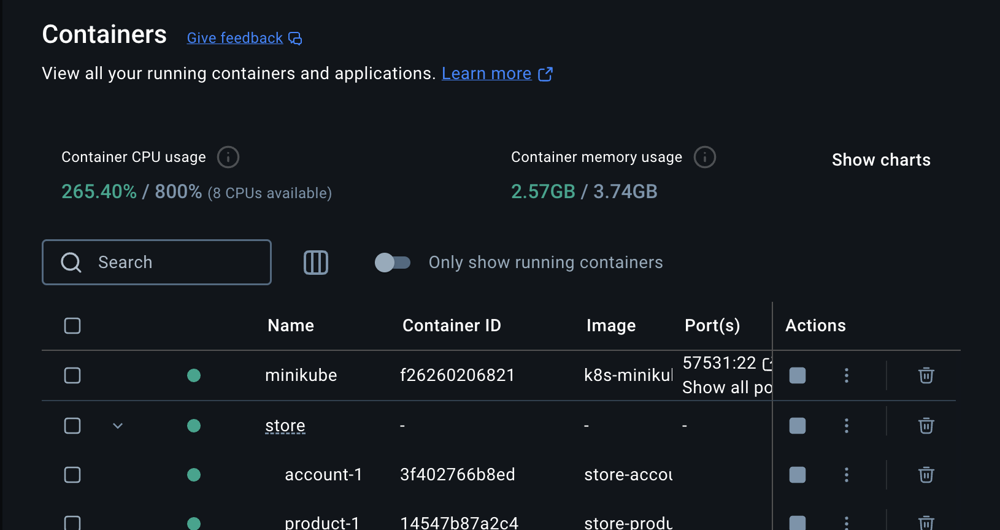
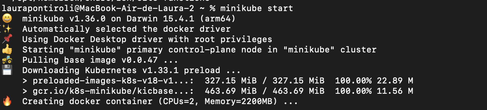
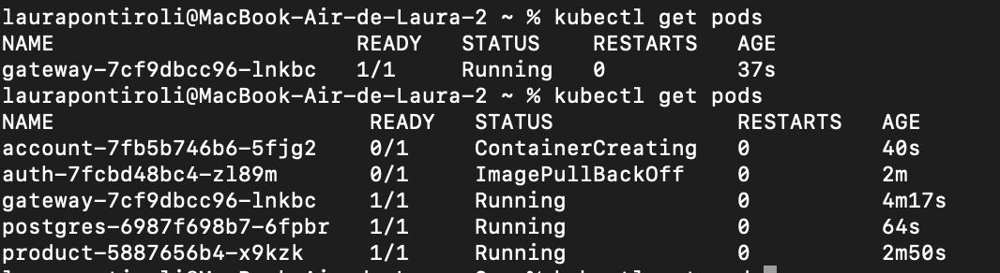

## Objetivo

O objetivo para esse roteiro era adicionar o MiniKube(Kubernets) para o nosso serviço. O Kubernetes é uma plataforma que orquestra containers, automatizando sua implantação e gerenciamento. O MiniKube é sua versão local para desenvolvimento.

## Montagem do Roteiro

### Tarefa 1

Baixar o Minkube pelo homebrew

Para isso, como eu já tinha homebrew instalado, só tive que rodar ` % brew install minikube  `

Depois disso, rodei o minikube para gerar o cluster no meu docker 



E rodar a imagem no terminal com `minikube start`



Assim criamos a imagem do minikube no nosso docker e podemos subir os serviços nele.

### Tarefa 2 

Adicionar os nossos serviços **todos os repositórios service** no Minikube

Para isso foi necessário criar as pastas `k8s` em todos os services no seguinte formato. 


!!! tip "Exemplo no Account Service"

    ``` { .tree }
    account-service
        k8s
            configmap.yaml
            deployment.yaml
            service.yaml
    ```


    === "configmap.yaml"

        ``` { .yaml .copy .select linenums="1" }
        --8<-- "https://raw.githubusercontent.com/laupontiroli/account-service/main/k8s/configmap.yaml"
        ```

        ```{ .bash .copy .select }
        kubectl apply -f ./k8s/configmap.yaml
        kubectl get configmap
        ```

    === "deployment.yaml"

        ``` { .yaml .copy .select linenums="1" }
        --8<-- "https://raw.githubusercontent.com/laupontiroli/account-service/main/k8s/deployment.yaml"
        ```

        ```{ .bash .copy .select }
        kubectl apply -f ./k8s/deployment.yaml
        kubectl get deployments
        kubectl get pods
        ```

    === "service.yaml"

        ``` { .yaml .copy .select linenums="1" }
        --8<-- "https://raw.githubusercontent.com/laupontiroli/account-service/main/k8s/service.yaml"
        ```

        ```{ .bash .copy .select }
        kubectl apply -f ./k8s/service.yaml
        kubectl get services
        ```


Onde os arquivos k8s.yaml variam pra necessidade de cada serviço. 

### Tarefa 3 

Depois de criar esses arquivos e rodar minikube start, foi necessário entrar em todas essas pastas e adicionar cada arquivo yaml com ` kubectl apply -f <filename.yaml>`

depois de rodar todos, verifiquei que eles estavam no minikube com o comando `kubeclt get pods`



## Discussões

Esse roteiro foi parecido com o Jenkins em relação a dificuldade. Uma vez ententendo o passo a passo foi tranquilo porque são arquivos de configuração prontos, mas precisa entender todo o processo.

## Conclusão

O kubernets é uma ótima ferramenta para adicionar em projetos grandes que podem demandar mais de uma imagem devido a demanda pelo serviço.